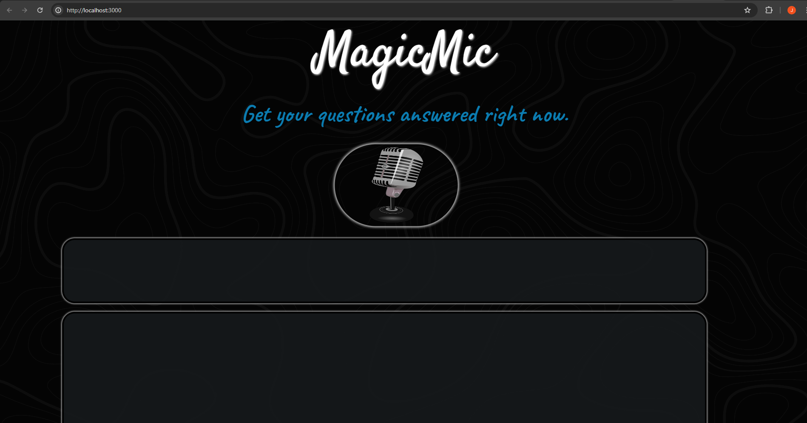
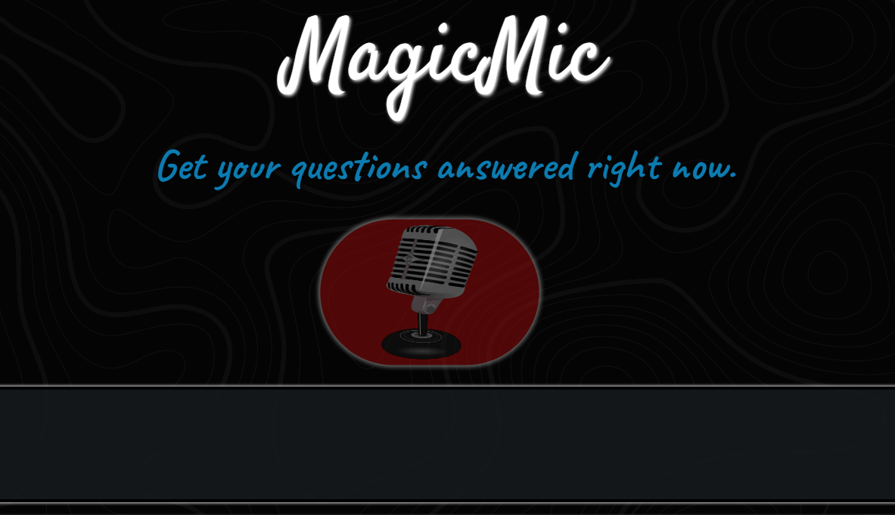
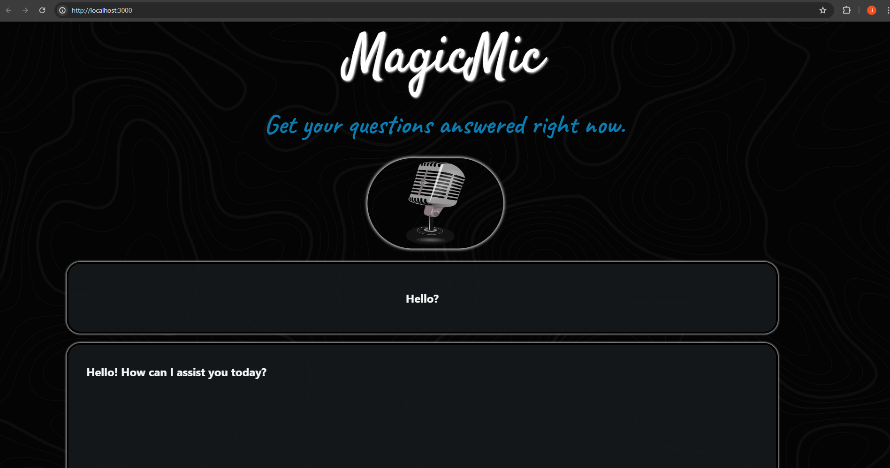
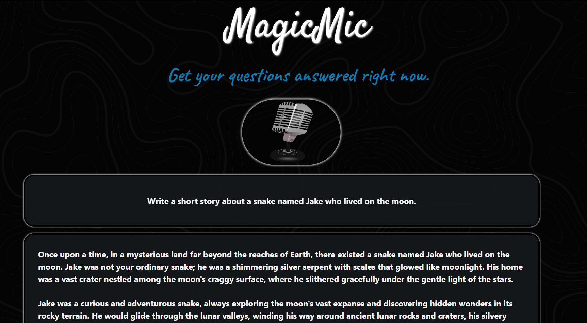
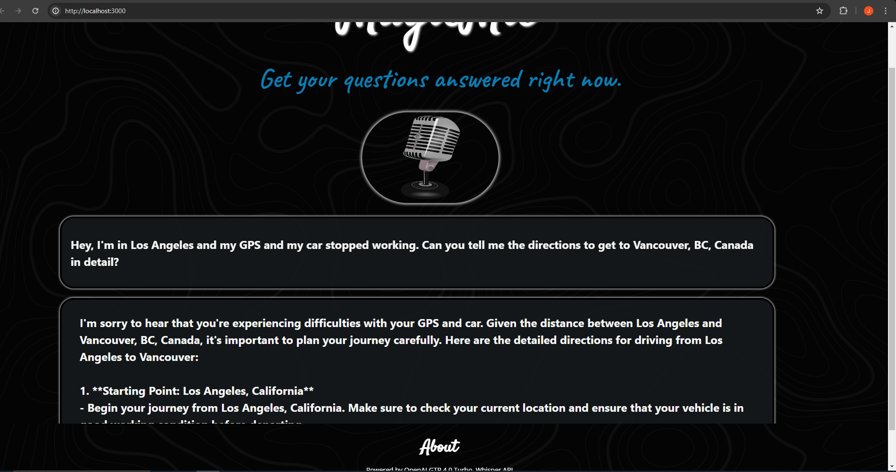
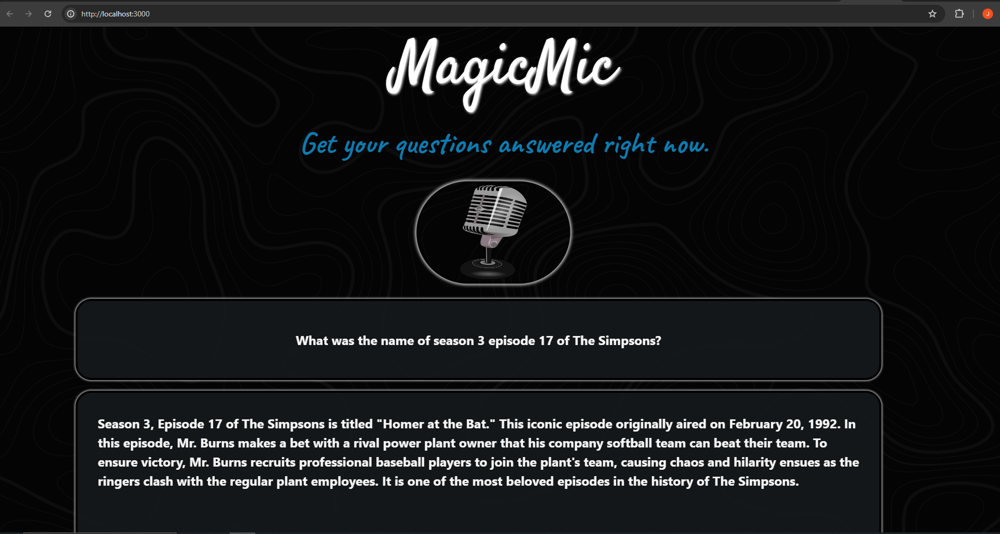
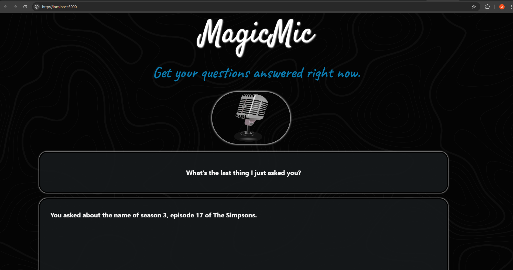

# MagicMic

# What is MagicMic?
   MagicMic is a simple web application that records a users question from their microphone
   
   This recorded question is then translated to text very accuratley using OpenAI - Whisper API
   
   The translated text is shown to the user for clarity
   
   Translated text is now sent to OpenAI - GTP 4.0 Turbo API and a response is returned.
   
   This detailed response is now displayed to the user in a second display containing the answer to their initial question

   

# System Walkthrough

---
 

---

---

---

---

---

---

## These Files are missing from repo due to large file size
   - whisperAPIServer/myenv/Lib/site-packages/torch/lib/torch_cpu.dll
   - whisperAPIServer/myenv/Lib/site-packages/torch/lib/dnnl.lib
